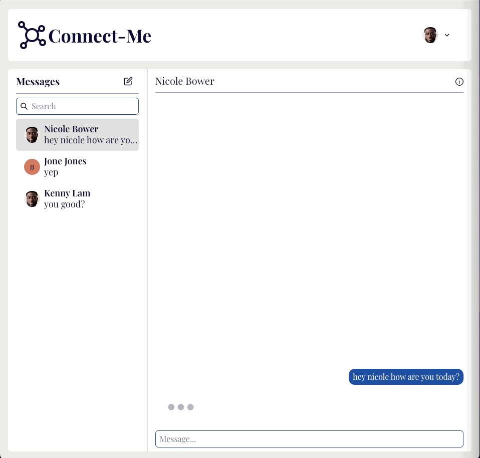
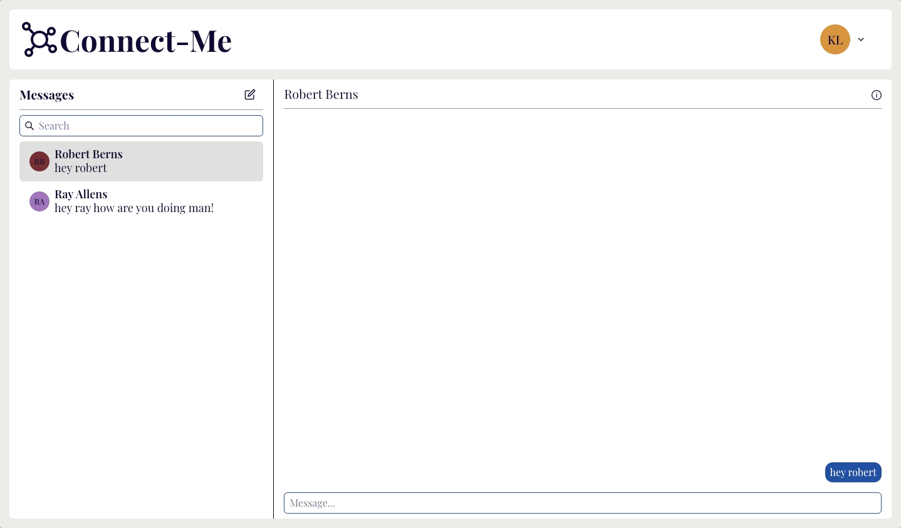
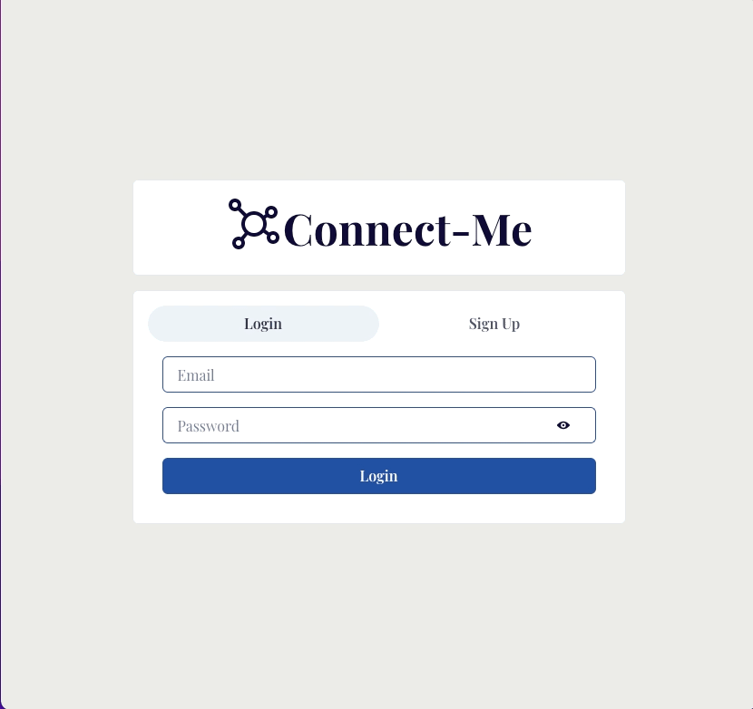
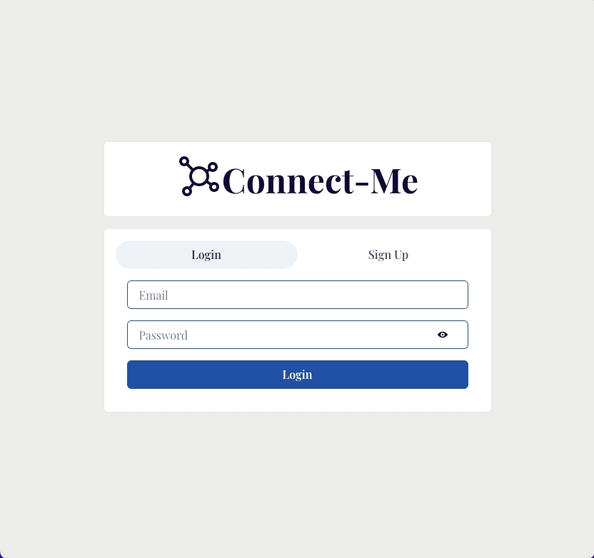
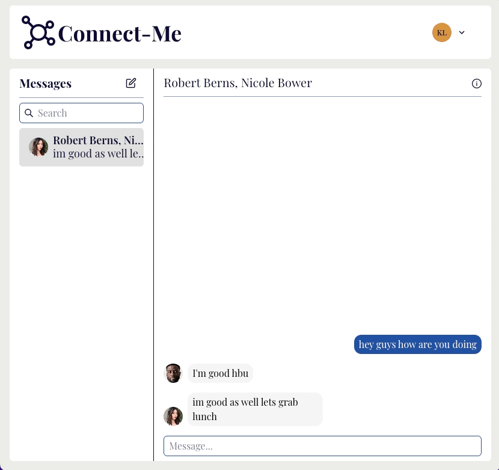
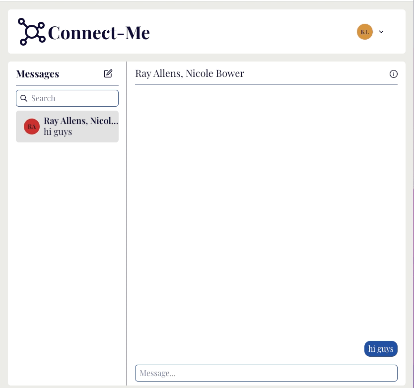
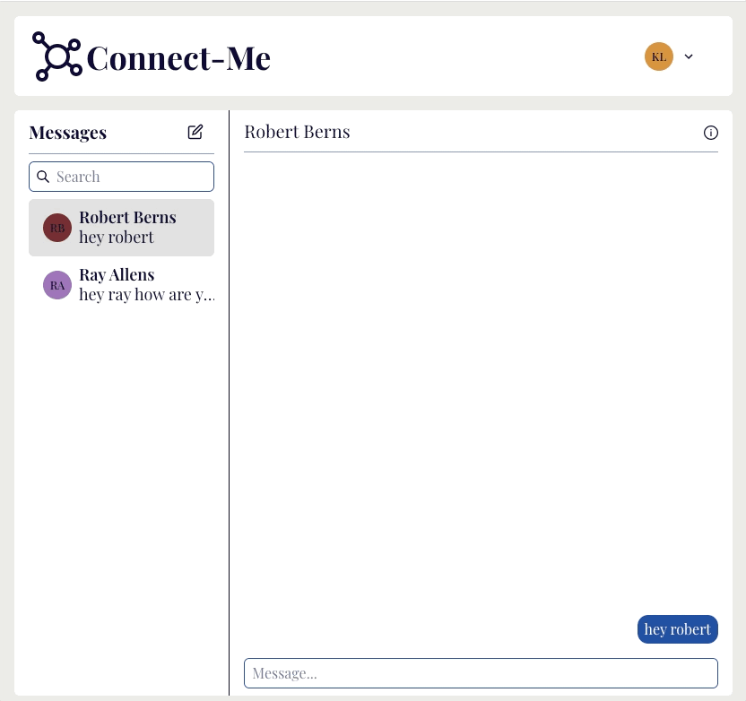

<p align="center">
    
</p>

## Overview

This is a responsive Chat Application. The application supports real-time messaging in individual
and group settings, allows users to remove and/or add participants into conversations,
delete and/or leave conversations and supports profile images.

## Technology

- 
- 
- 
- 
- 

## Features

- Responsive Design
<p align="center">
    
</p>

- Login and Signup Capability
<p align="center">
    
    
</p>

- Group Conversations
<p align="center">
    
</p>

- Edit Group Conversation Participants
<p align="center">
    
</p>

- Leave Group Conversation and Delete Conversation
<p align="center">
    
</p>

- Profile Images
<p align="center">
    
</p>

## Getting Started

### Prerequisites

- yarn/npm
- Sign up for MongoDB Atlas
  - Create a shared database

### Backend Installation

```sh
# Clone the repo
git clone git clone https://github.com/klam2k20/Chat.git

# Create config.env
cd Chat/server
PORT=8080
MONG0DB_URI=<MONGODBURI>
JWT_SECRET=<SECRET-KEY>

# Install dependencies
yarn install

# Start the server
yarn start
```

### Frontend Installation

```sh
cd ../client

# Install dependencies
yarn install

# Start the application on port 3000
yarn start
```
